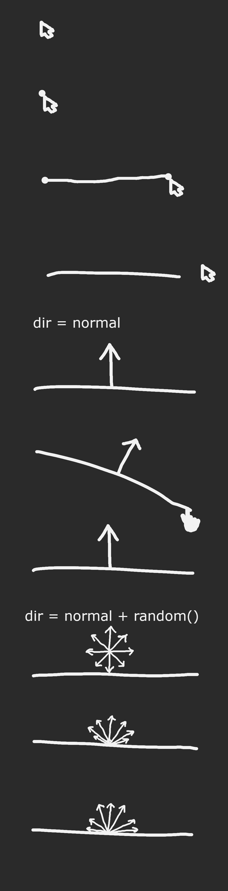

# Cosine-weighted hemisphere visualization with Motion Canvas

I created this animation with [Motion Canvas](https://motioncanvas.io) to aid me in a [Mastodon discussion](https://mastodon.gamedev.place/@mynameistrez/110132648398286786).

## The animation started as a sketch

## Running

1. Execute `npm run serve` in the repository
2. Go to http://localhost:9000/ in your browser

## Render

First you have to generate the PNG frames:

1. Go to http://localhost:9000/ in your browser
2. Click the `Video Settings` button on the left
3. Press the blue `RENDER` button

### mp4

`ffmpeg -framerate 60 -i output/project/%06d.png -crf 1 output/output.mp4`

### webm

`ffmpeg -framerate 60 -i output/project/%06d.png -crf 1 output/output.webm`

### gif

`ffmpeg -framerate 60 -i output/project/%06d.png -vf "fps=50,scale=1920:-1:flags=lanczos,split[s0][s1];[s0]palettegen[p];[s1][p]paletteuse" -loop 0 output/output.gif`

See [this post](https://superuser.com/a/556031/1287700) for an explanation of the command.

The reason `fps=50` is used for the output GIF here instead of `fps=60`, is because the maximum compatible value for that property is 50. Note that the input framerate is still 60 FPS.

Note that the `scale=1920` setting here causes it to take a really long time to render, where the output makes it seem stuck printing `frame=0 fps=0.0` at the start, so you might want to lower that value to `960` or `480`.
